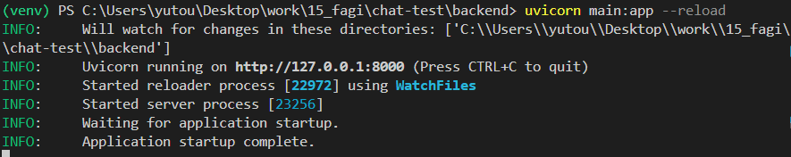
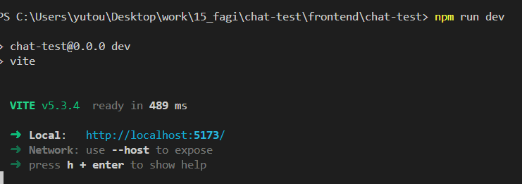
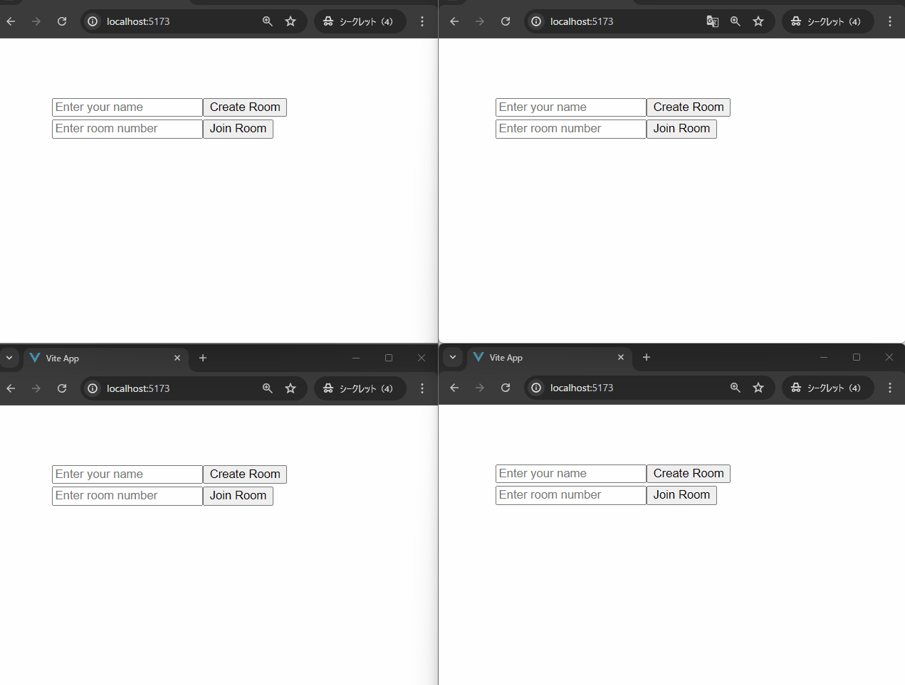
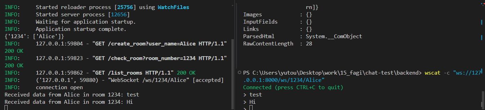
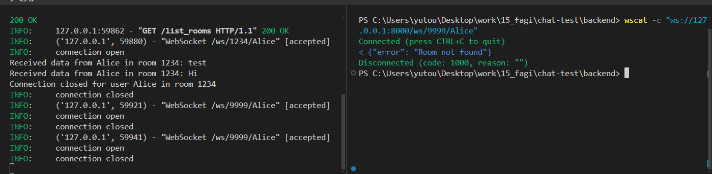
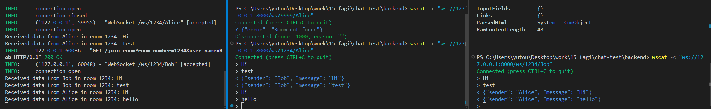

# chat-test


# FastAPIの通信テスト
ルームチャットのフロントエンドとバックエンドの連携テスト

ディレクトリ構成
```bash
|- backend
  |-main.py
|- frontend
  |-chat_test
    |-src
      |-App.vue
      |-components
        |-Chat.vue
```

## 1.サーバの立ち上げ
バックエンドのサーバ立ち上げ
```bash
# ディレクトリ移動
cd chat-test\backend
# 仮想環境の有効化
.\venv\Scripts\activate
# サーバの起動
uvicorn main:app --reload
```


フロントエンドのサーバ立ち上げ
```bash
# ディレクトリ移動
cd frontend\chat-test
# サーバの起動
npm run dev
```


## 2.動作テスト


# easy_test
ルームチャットのバックエンド側の実装テスト

|項目|説明|
|---|---|
|curl|http通信テスト|
|wscat|webscoket通信テスト|


## 1.バックエンドのサーバ立ち上げ
```bash
uvicorn easy_test:app --reload
```
```bash
INFO:     Will watch for changes in these directories: ['C:\\Users\\yutou\\Desktop\\work\\15_fagi\\chat-test\\backend']
INFO:     Uvicorn running on http://127.0.0.1:8000 (Press CTRL+C to quit)
INFO:     Started reloader process [12676] using WatchFiles
INFO:     Started server process [25528]
INFO:     Waiting for application startup.
INFO:     Application startup complete.
```

## 2.ルーム作成処理

```bash
curl "http://localhost:8000/create_room?user_name=Alice"
```
```bash
StatusCode        : 200                                                     
StatusDescription : OK                                                      
Content           : {"room_number":"1234","user_name":"Alice"}
RawContent        : HTTP/1.1 200 OK
                    Content-Length: 42
                    Content-Type: application/json
                    Date: Sun, 28 Jul 2024 13:21:17 GMT
                    Server: uvicorn

                    {"room_number":"1234","user_name":"Alice"}
Forms             : {}
Headers           : {[Content-Length, 42], [Content-Type, application/json] 
                    , [Date, Sun, 28 Jul 2024 13:21:17 GMT], [Server, uvicorn]}
Images            : {}
InputFields       : {}
Links             : {}
ParsedHtml        : System.__ComObject
RawContentLength  : 42
```

## 3.ルームチェック
```bash
curl "http://localhost:8000/check_room?room_number=1234"
```
```bash
StatusCode        : 200
StatusDescription : OK
Content           : {"exists":true,"user_name":["Alice"]}
RawContent        : HTTP/1.1 200 OK
                    Content-Length: 37
                    Content-Type: application/json
                    Date: Sun, 28 Jul 2024 13:14:10 GMT
                    Server: uvicorn

                    {"exists":true,"user_name":["Alice"]}
Forms             : {}
Headers           : {[Content-Length, 37], [Content-Type, application/json] 
                    , [Date, Sun, 28 Jul 2024 13:14:10 GMT], [Server, uvico 
                    rn]}
Images            : {}
InputFields       : {}
Links             : {}
ParsedHtml        : System.__ComObject
RawContentLength  : 37
```

### ルームの一覧をチェック
```bash
curl "http://localhost:8000/list_rooms"
```
```bash
StatusCode        : 200
StatusDescription : OK
Content           : {"rooms":{"1234":["Alice"]}}
RawContent        : HTTP/1.1 200 OK
                    Content-Length: 28
                    Content-Type: application/json
                    Date: Sun, 28 Jul 2024 13:22:35 GMT
                    Server: uvicorn

                    {"rooms":{"1234":["Alice"]}}
Forms             : {}
Headers           : {[Content-Length, 28], [Content-Type, application/json] 
                    , [Date, Sun, 28 Jul 2024 13:22:35 GMT], [Server, uvico 
                    rn]}
Images            : {}
InputFields       : {}
Links             : {}
ParsedHtml        : System.__ComObject
RawContentLength  : 28
```

## 4.ルーム参加(webscoket接続)
```bash
wscat -c "ws://127.0.0.1:8000/ws/1234/Alice"
```


### ルーム参加(失敗)
```bash
wscat -c "ws://127.0.0.1:8000/ws/9999/Alice"
```


### ルーム参加(ほかのユーザの参加)
```bash
curl "http://localhost:8000/join_room?room_number=1234&user_name=Bob"
```
```bash
StatusCode        : 200                                                    
StatusDescription : OK                                                     
Content           : {"exists":true,"user_name":["Alice","Bob"]}
RawContent        : HTTP/1.1 200 OK
                    Content-Length: 43
                    Content-Type: application/json
                    Date: Sun, 28 Jul 2024 13:26:18 GMT
                    Server: uvicorn

                    {"exists":true,"user_name":["Alice","Bob"]}
Forms             : {}
Headers           : {[Content-Length, 43], [Content-Type, application/json 
                    ], [Date, Sun, 28 Jul 2024 13:26:18 GMT], [Server, uvi 
                    corn]}
Images            : {}
InputFields       : {}
Links             : {}
ParsedHtml        : System.__ComObject
RawContentLength  : 43
```
```bash
wscat -c "ws://127.0.0.1:8000/ws/1234/Bob"
```

